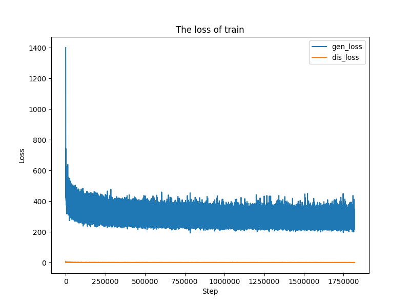

Environment:

- Ubuntu 16.04 LTS
- TensorFlow 1.4
- Python 2.7
- OpenCV 3.2.0

### 1. Introduction of our approach

​	In this work, we aim to learn a direct mapping from hand pose and depth hand image. Our goals are two-fold: (1) Be capable of exploring the underlying conditional image formation distribution $p(X|y)$, where $X$ denotes synthesized depth hand image conditioning on the particular realization $y$ of hand pose; (2) Demonstrate that synthetic images are useful in boosting the performance of a supervised segmentation method, when they are added to the training set. 

​	In Order to generate the depth hand images as similar as raw depth hand images possible, we propose to combined GAN and style-transfer to obtain the synthesized images.  The structure can be divided into three parts, including the generator, discriminator, and style transfer network. The generator generates synthesized hand images with hand poses, and then we follow the GANs idea for this two-player zero-sum game setting and consider the optimization problem that characterizes the interplay between G and D, the last style-transfer part aims to transform the smooth synthetic images generated into the more similar depth hand images to real ones.

### 2. Generator G and Discriminator D

Suppose the generator $G_{\theta}$, and the discriminator function $D_{r}$, we fellow the GANs optimization problem:

​

with $\lambda$ is emperically set to 1, the last term is introduced to ensure the synthetic image will not deviate far from the real image, and we consider the following formulation:

​                $L_{G}(G_{\theta}) = E_{x,y~p(x,y)}[||x-G_{\theta}(y)||^{2}_{F}]$

To summarize, learning the generator $G$ amounts to minimizing

​               $L_G(G_{\theta}) = - \sum_\limits{i} log D_r(G_{\theta}(y_i))+\lambda||x_i - G_{\theta}(y_i)||^{2}_F$

On the other hand, discriminator $D$ attempts to properly separate the real images from synthetic ones by maxmizing

​               $L_D(D_r)=\sum_\limits{i}logD_r(x_i,y_i)+log(1-D_r(G_{\theta}(y_i)))$

The learning process is practically carried out by alternating optimize the $G_{\theta}$ and $D_r$.

### 3. The Style transfer variant

​	Style transfer is a task of generating image, whose style is equal to a style image and content is equal to a content image. Now that we have a clear definition of the style and content representation, and then we can define a loss function which essentially shows us how far away our generated images are from being the perfect style trandfer.

​	Without style transfer, the synthetic images from the generator are rather smooth, so style transfer can be applied to transform the synthetic images into more similar to real ones. In the following，we describe in detail in the specific net architecture of our style transfer. We follow the style transfer idea to utilize the convolutional neural network of VGG-19 to extract the features from its multiple layers.  We can define the index $i$ of layers and $j$ of blocks.

**Content loss:** Given the chosen content layer $l$, the content loss is defiend as the euclidean distance between the feature map $F^l$ of our content image $x$ and the feature map $P^l$ of our generated image $\hat{x}$.When the content representation of image $C$ and image $Y$ are exactly the same, this loss becomes approximately 0:

​	      $l_{cont}(G_{\theta})= \sum_\limits{i,j}\frac{1}{2}(F^l_{i,j}-P^l_{i,j})$

**style loss:** We will do something similar for the style-layers, but now we want to measure which features in the style-layers activate simultaneously for the style-image, and then copy this activation-pattern to the mixed-image. These feature correlations are given by Gram matrix $G^l_{i,j}$ , where $G^l_{i,j}$ is the innner product between the vecorised feature map $i$ ans $j$ in layer $l$:

​	     $G^l_{i,j} = \sum_\limits{k}F^l_{i,k}F^l_{j,k}$

The loss function for style is quite similar to out content loss, except that we calculate the Mean Squared Error for the Gram-matrices instead of the raw tensor-outputs from the layers.

​             $l_{sty}(G_{\theta})=\frac{1}{2}\sum_\limits{l=0}(G^l_{i,j}-A^l_{i,j})^2$

**Total variation loss:** Furthermore, we condiser encouraging spatial smoothness in generated phantom by incorporating the following total variation loss($\hat{x}$ stands for generated phantom, $\hat{x} \in R^{W \times H}$):

with $w,h \in W,H$, and $\hat{x}_{w,h}$ denotes the pixel value of  given location in phantom image $\hat{x}$.

​	The above-mentioned three loss functions together lead to $L_{ST}(G_{\theta})=w_{cont}l_{cont}+w_{sty}l_{sty}+w_{tv}l_{tv}$. Thus we consider the above style transfer loss $L_{ST}$, instead of $L_{G}(G_{\theta})$ . so generator $G$ now takes the objective function of the following form:

​               $L_G(G_{\theta}) = - \sum_\limits{i} log D_r(G_{\theta}(y_i))+L_{ST}(G_{\theta})$

the objective function of discriminator $D$ remains unchanged, the style transfer contribution from the target style image is obtained by back-propagation optimization of the above objective function.

### 4. Experimental Details

​	We can obtain the synthetic images, far similar to raw images, with GAN network and style transfer structure. We've tried GAN network, without style transfer structure, to gain the synthesized image which is smoother than the raw image. Due to GAN ignoring the noise of real depth images, style transfer is employed to extract the contours of the synthetic image and the textures of style image, and then to mix the content and style features to obtain the phantom based on a particular style representation provided by the single style image. Besides, it can be  emprically obeserved that style structure eliminates the shadow of image background. 

|                             Raw                              | Style                                                        |                      GAN+Style Transfer                      |
| :----------------------------------------------------------: | ------------------------------------------------------------ | :----------------------------------------------------------: |
|  |  |  |
|  |  |  |

